Setting up mobl
---------------

Currently mobl is solely distributed as an
[Eclipse](http://www.eclipse.org) plug-in. Eclipse is a very popular
integrated development environment with support for many different
programming languages. It is free and open source and plug-ins exist
for practically every version control system. Mobl requires Eclipse
3.5 "classic" or [3.6
"classic"](http://www.eclipse.org/downloads/packages/eclipse-classic-360/heliosr)
to run.

To make mobl run as smoothly as possible you need to make some adjustments
to the `eclipse.ini` file, which is usually found alongside the
eclipse executable. On Mac OS X there are two `eclipse.ini`
files, the one you have to adjust is stored _inside_ the `Ecipse.app`
directory. On my Mac it's located in
`/Applications/eclipse/Eclipse.app/Contents/MacOS/eclipse.ini`.

In this file, look for the line that says `-vmargs`. Before that line, make
sure it says:

    --launcher.XXMaxPermSize
    256m

and after the `-vmargs` line add the following:

    -ss16m
    -Xms200m
    -Xmx1024m

For me the entire file now looks like this (on Mac OS X Snow Leopard):

    -startup
    ../../../plugins/org.eclipse.equinox.launcher_1.0.201.R35x_v20090715.jar
    --launcher.library
    ../../../plugins/org.eclipse.equinox.launcher.cocoa.macosx_1.0.1.R35x_v20090707
    -showsplash
    org.eclipse.platform
    --launcher.XXMaxPermSize
    256m
    -vmargs
    -ss512m
    -Xms200m
    -Xmx1024m
    -Xdock:icon=../Resources/Eclipse.icns
    -XstartOnFirstThread
    -Dorg.eclipse.swt.internal.carbon.smallFonts
    
### Installing the Plug-in

After adjusting `eclipse.ini`, launch Eclipse and choose from the "Help" menu the
option "Install new software...". 

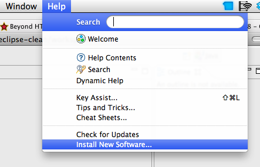

Then add the following update site:

    http://mobl-lang.org/update

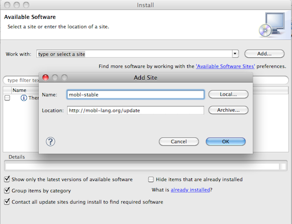

If no packages appear, uncheck "Group items by category", to show
them. Then select to install `mobl editor`, choose next, accept and
finish, let it download and restart.  You can ignore the warning about
unsigned content.

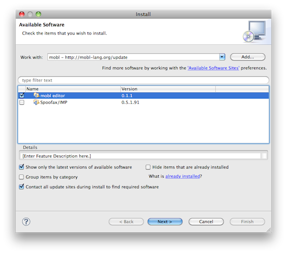

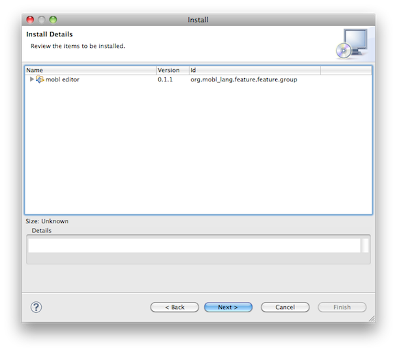

### Creating Your First Project

To test if everything works OK, let's create our first mobl project.
Go to File > New > Project... 

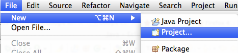

Then select `mobl project` and press _Next_. 

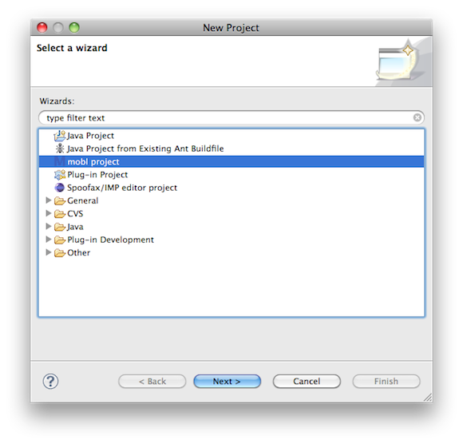

Fill in a project and application name, name your project and
application "firstapp" and push _Finish_.

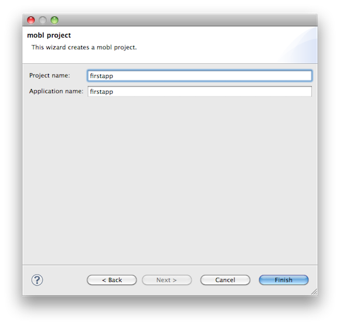

Modify the generated `firstapp.mobl` file to say the following:

    application firstapp

    import mobl::ui

    screen root() {
      header("Hello world")
    }

Then, save the file. A directory structure is now being
generated in your project's `www/` folder. To test your application
this `www/` directory needs to be accessible through a web server. If
you have a webserver running on your machine you can configure it to
serve files from this `www` directory, if you don't, you can copy the
contents of the `www/` folder to a web server someplace else. Note that
if have a [Dropbox](http://www.dropbox.com) account, you can create
a symlink from your `Public` folder, which is accessible from the
web and load your application from there.

You can test your application either on your phone, a simulator or
simply a Webkit-based browser such as Safari or Chrome, Firefox also
works if Google Gears is installed. In Safari 5 you can switch
your User Agent between "Default", "iPhone" and "iPad" to switch
between the generic and iOS-specific controlsets.

### iPhone: Turning Your Web App Into a "Proper" App

On the iPhone (or iPhone simulator) you set-up your application as a
"proper" application by tapping the "+" icon at the bottom, then
choosing "Add to Home Screen", give it a name and push _Add_. The
application will be added to the home screen and will appear
full-screen when launched, without any browser chrome (like the
address bar or bottom navigation buttons.

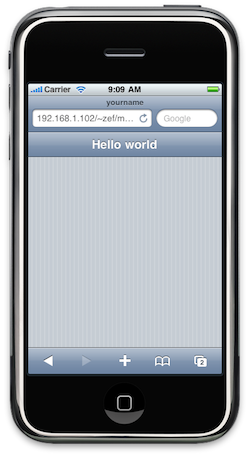
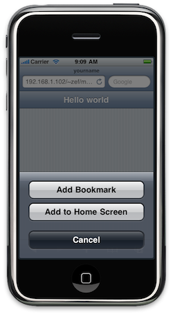
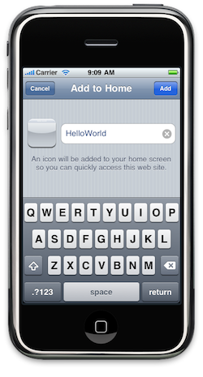
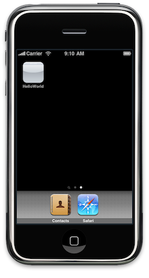
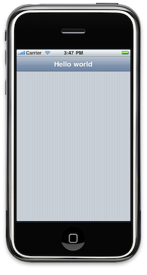
