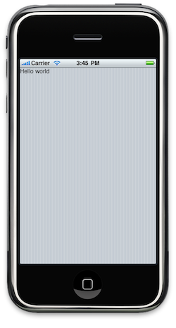
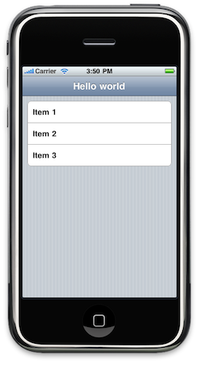
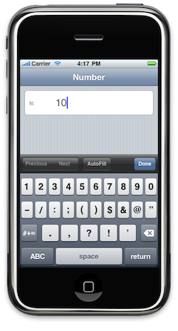
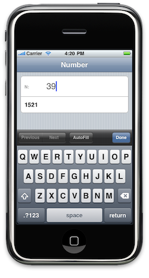
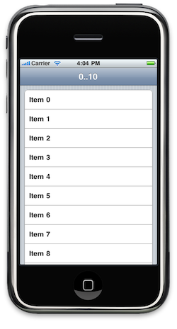

User interface definition
=========================

User interfaces in mobl are built of three things:

* __screens__, as the name suggests, these are full-screen "windows"
containing controls. Screens can return values and are
invoked from the scripting language. The `root` screen is the screen
that is loaded when the application is launched.
* __controls__, are the components that are composed to build the user
interface. Controls vary from simple labels to full-fledged
interactive maps.
* __control structures and primitives__, mobl contains a couple of
low-level primitives (such as HTML tags and string literals) and
control structures (such as `list` and `cond`) to build user
interfaces.

Screens
-------

Every application is required to define a `root` screen:

    screen root() {
      // content here
    }

Screens and controls both have the same basic structure, they start
with a `screen` or `control` keyword, followed by a name and signature
of the screen or control. The structure of the control or screen is
subsequently defined between curly braces. Here is the complete code of a simple "Hello
world" application:

    application hello

    screen root() {
      "Hello world!"
    }

When executed in the iPhone simulator, it will render the following screen:

Not very exciting, let's use a control from one of the control
libraries that come with mobl: `mobl::ui::generic`. The control we'll
use is called `header` and renders, well, a header:

    import mobl::ui::generic

    screen root() {
      header("Hello world")
    }

Now, that looks more like it!

Now, let's add a group with three items:

    screen root() {
      header("Hello world")
      group {
        item { "Item 1" }
        item { "Item 2" }
        item { "Item 3" }
      }
    }

Which will look like this:

Controls
--------

Let's build our own very simple control. A control that renders an
item with the the text "Item", followed by the number that is passed
as an argument. We define the control as follows:

    control itemNumber(n : Num) {
      item { "Item " label(n) }
    }

The `label` control (also part of the `mobl` module) simply renders
the text of its argument on the screen. You can use your brand new
control from the `root` screen (or any other screen or control, for
that matter) as follows:

    screen root() {
      header("Hello world")
      group {
        itemNumber(1)
        itemNumber(2)
        itemNumber(3)
      }
    }

When loaded, the application looks exactly the same as before, but is
slightly more concise. As you may have noticed some controls get
arguments between parentheses `(` and `)`, but others also get passed
controls as a body, between curly braces, like `group` for instance.

You can build controls yourself that allow that by using the special
`elements()` control. As an example, let's build a control that combines
a header with a group. It takes the string displayed in the header as an argument, and the items we want to put in the group as body elements:

    control headerGroup(title : String) {
      header(title)
      group {
        elements()
      }
    }

We can now use it as follows:

    screen root() {
      headerGroup("Hello world") {
        itemNumber(1)
        itemNumber(2)
        itemNumber(3)
      }
    }

Variables
---------

Screen and controls can also define and use local variables. In the
context of user interfaces there are two types of variables:

* Regular variables, can be read from and written to
* Derived variables, that can only be read and are derived from other variables

The following screen defines a local variable `n` that is editable
using the `inputNum` control. Note that we pass a _named arguments_ to
it, a named argument is an optional argument. In this case it will set
the `label` argument of the control, resulting in a label to be
displayed as part of the control:

    screen root() {
      header("Number")
      var n = 0
      group {
        item { inputNum(n, label="N:") }
      }
    }
    
This will look as follows:

We will now add a _derived_ variable using the `var variable <-
expression` syntax. We define a variable `nSquared` that will always
represent the value of `n * n`. Note that `nSquared` will be
recalculated when the value of `n` changes (e.g. when editing it using
the `inputNum` control):

    screen root() {
      header("Number")
      var n = 0
      var nSquared <- n * n
      group {
        item { inputNum(n, label="N:") }
        item { label(nSquared) }
      }
    }

When we run the application, and _as we edit_ the value of `n` in the
textbox the value of `nSquared`, which appears below it, is updated:
  

Lists
-----

Sometimes you want to repeat a part of the user interface a couple of
times, for instance for every element in a list. To realize this, mobl
has the `list` construct. The following `root` screen creates a group
with an item for every number from 0 to 10 (0, 1, 2, 4, 5, 6, 7, 8, 9).
It uses the `range` function that returns a list of numbers:

    screen root() {
      header("0..10")
      group {
        list(n in range(0, 10)) {
          item { "Item " label(n) }
        }
      }
    }

Which will look as follows:

When
----

    screen root() {
      header("Check!")
      var b = false
      group {
        item { checkbox(b, label="Check me!") }
      }
      when(b) {
        "The checkbox is checked!"
      }
    }

